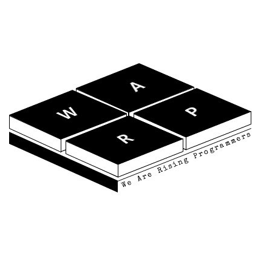

# data-structure-for-student
__한국산업기술대 학술소모임 Warp의 data-structure-for-student 저장소를 방문해주셔서 감사합니다.__ (2018/12/18)

> 이 저장소는, 학과 2학년 1학기 과정인 자료구조 과목을 수강하는 학생을 주 대상으로 하여 참고할만한 자료구조 코드들로 구성되어 있습니다.
>
> 이에 따라, 대부분의 라인에 주석을 달고, 최소한의 문법을 사용하는 등, 프로그래밍 언어의 대한 숙련도가 다소 부족한 학생이더라도 최대한 각 자료구조를 이해할 수 있도록 코딩하고 있습니다.

---

__구현된 자료구조 목록입니다.__

___List___
* [Single List(C)](./자료구조/자료구조/src/List/c/SingleList.h)

___Stack___
* [Simple Stack(C++)](./자료구조/자료구조/src/Stack/cpp/SimpleStack.h)

___Queue___
* [Simple Queue(C++)](./자료구조/자료구조/src/Queue/cpp/SimpleQueue.h)

___Tree___
* [Binary Tree(C)](./자료구조/자료구조/src/Tree/c/BinaryTree.h)
* [RedBlack Tree(C++)](./자료구조/자료구조/src/Tree/cpp/Custom_RedBlackTree.h)

---
__Contributor__
  - [이상기](https://github.com/Lunta)
  - [원성연](https://github.com/GameForPeople) 
>   
> 코드를 확인하시고, 잘못된 부분이 있다면 ___Pull Request___ (혹은 ___Push___ )  를 부탁드립니다.     
> 그 외 개선할 점이나, 요청하시고 싶은 자료구조가 있으시다면 ___Programmers Team___ 에 ___Discussion___ 을 작성해 주세요!    
> 목록에 없는 자료 구조를 구현해주시는 것도 언제든지! 누구나! 감사합니다.     
> __PR은 언제든지 환영입니다! :)__  __감사합니다__

